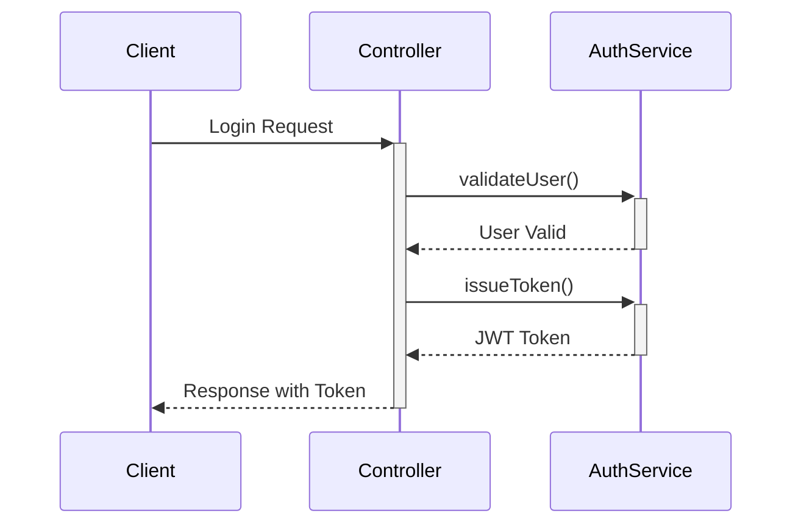
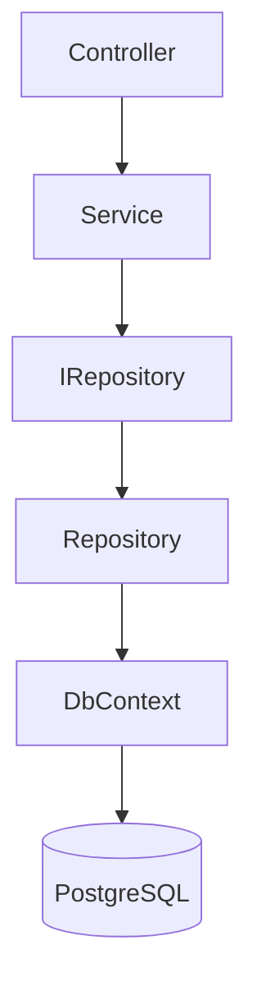
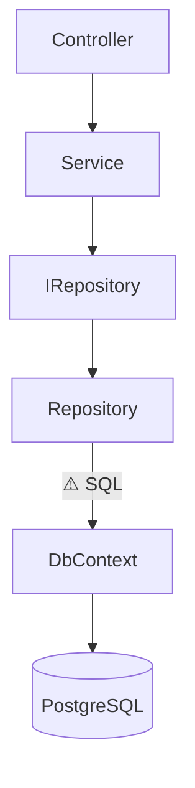

# Code Review Context Analyzer — Examples

## Example 1: Auth Service Refactor (Multi-module)

**Scenario**: A PR refactors `AuthService` to introduce JWT dual-verification, touching 3+ modules.

### Output

````markdown
### 🐇 Code Review Context Report

**📝 變更摘要 (Change Summary)**
本次 PR 主要重構了 `AuthService`，引入了 JWT 雙重驗證機制 (Dual Verification)。
- **核心變更 (Core Changes)**: 將 `login()` 方法拆分為 `validateUser()` 與 `issueToken()`，實現職責分離 (Separation of Concerns)。
- **影響範圍 (Impact Scope)**: `UserController`、`Middleware/Auth`、`auth.interface.ts`。

**🗺️ 邏輯導覽 (Logic Walkthrough)**
1. 先看 `auth.interface.ts`：了解新的 Token 介面定義 (Interface Definition)。
2. 接著看 `auth.service.ts`：檢視核心邏輯的拆分，確認 `validateUser()` 與 `issueToken()` 的錯誤處理。
3. 最後看 `user.controller.ts`：確認呼叫端是否正確處理了新的 Exception Type。

**📊 架構視覺化 (Architecture Visualization)**

````

**Why this output?**
- 3+ modules affected → sequence diagram **forced** by decision logic.
- Reading order follows the call chain: interface → service → controller.

---

## Example 2: Single-file Config Fix

**Scenario**: A PR updates a single configuration file with no external dependencies.

### Output

```markdown
### 🐇 Code Review Context Report

**📝 變更摘要 (Change Summary)**
修正 `appsettings.json` 中的 Redis 連線字串 (Connection String)，將 Timeout 從 5s 調整為 30s。
- **核心變更 (Core Changes)**: `ConnectionStrings.Redis` timeout 參數修改。
- **影響範圍 (Impact Scope)**: 僅影響 Redis 快取連線，無程式碼層面變更。

**🗺️ 邏輯導覽 (Logic Walkthrough)**
1. 直接查看 `appsettings.json`：確認 timeout 值是否合理，並比對其他環境設定檔是否需要同步修改。

**📊 架構視覺化 (Architecture Visualization)**
_因變更僅涉及單一設定檔且無外部依賴，略過架構圖。_
```

**Why this output?**
- Single file, no external deps → diagram **skipped** by decision logic.
- Reading guide is minimal — just one file to check.

---

## Example 3: Large Diff (1000+ lines)

**Scenario**: A major refactor PR with 1,200+ changed lines across 15 files.

### Output

```markdown
### 🐇 Code Review Context Report

**📝 變更摘要 (Change Summary)**
大規模重構資料存取層 (Data Access Layer)，從 Raw SQL 遷移至 Repository Pattern + Entity Framework Core。
- **核心變更 (Core Changes)**: 新增 `Repositories/` 資料夾，引入 `IRepository<T>` 泛型介面與對應實作。
- **影響範圍 (Impact Scope)**: `Controllers/`、`Services/`、`Models/`、`Data/` 等 4 個模組，共 15 個檔案。

**🗺️ 邏輯導覽 (Logic Walkthrough)**
> ⚠️ 本次變更超過 1000 行，採用模組級摘要模式 (Module-level Summary)。

| 模組 (Module) | 變更概述 (Summary) | 優先閱讀順序 |
|---|---|---|
| `Models/Database/` | 新增 Entity 定義與 DbContext 設定 | 1️⃣ |
| `Repositories/` | 新增 Repository 介面與實作 | 2️⃣ |
| `Services/` | 將 Raw SQL 呼叫替換為 Repository 注入 | 3️⃣ |
| `Controllers/` | 調整依賴注入 (DI) 與錯誤處理 | 4️⃣ |

**📊 架構視覺化 (Architecture Visualization)**

```

**Why this output?**
- 1200+ lines → **module-level summary** activated. Per-function analysis at this scale produces diminishing returns for human reviewers (information overload). Token efficiency is a secondary benefit.
- 3+ modules → sequence diagram forced; flowchart chosen for layered architecture clarity.
- **Tradeoff**: Module-level summaries sacrifice function-level granularity. If a specific module looks risky (e.g. security-sensitive changes), request a **focused drill-down** on that module.

---

## Example 4: Large Diff with Security-Sensitive Module (Security Flag Triggered)

**Scenario**: Same scale as Example 3 (1,200+ lines, 15 files), but the `Repositories/` module now contains raw SQL query construction that touches user input — triggering the security flag.

### Output

```markdown
### 🐇 Code Review Context Report

**⚠️ 安全與風險提示 (Security & Risk Flags)**
- 🔴 **Repositories/**: Contains raw SQL query construction with user-supplied parameters — requires focused drill-down review.

**📝 變更摘要 (Change Summary)**
大規模重構資料存取層 (Data Access Layer)，從 Raw SQL 遷移至 Repository Pattern + Entity Framework Core。
- **核心變更 (Core Changes)**: 新增 `Repositories/` 資料夾，引入 `IRepository<T>` 泛型介面與對應實作。
- **影響範圍 (Impact Scope)**: `Controllers/`、`Services/`、`Models/`、`Data/` 等 4 個模組，共 15 個檔案。

**🗺️ 邏輯導覽 (Logic Walkthrough)**
> ⚠️ 本次變更超過 1000 行，採用模組級摘要模式 (Module-level Summary)。

| 模組 (Module) | 變更概述 (Summary) | 優先閱讀順序 |
|---|---|---|
| `Repositories/` ⚠️ | 新增 Repository 實作，包含 SQL 參數化查詢 | 1️⃣ |
| `Models/Database/` | 新增 Entity 定義與 DbContext 設定 | 2️⃣ |
| `Services/` | 將 Raw SQL 呼叫替換為 Repository 注入 | 3️⃣ |
| `Controllers/` | 調整依賴注入 (DI) 與錯誤處理 | 4️⃣ |

**📊 架構視覺化 (Architecture Visualization)**

```

**Why this output?**
- Security flag **triggered**: `Repositories/` contains SQL-related changes while module-level summary is active → Decision Logic forces the `⚠️ 安全與風險提示` section.
- Reading order **reordered**: The flagged module (`Repositories/`) is promoted to priority 1️⃣ (was 2️⃣ in Example 3) so reviewers examine the risky code first.
- Diagram annotates the risk edge with `⚠️ SQL` to visually highlight where sensitive data flows.

**Key differences from Example 3:**
- `⚠️ 安全與風險提示` section appears at the top (absent in Example 3).
- Flagged module is promoted in reading order priority.
- Mermaid edge annotation marks the sensitive path.
