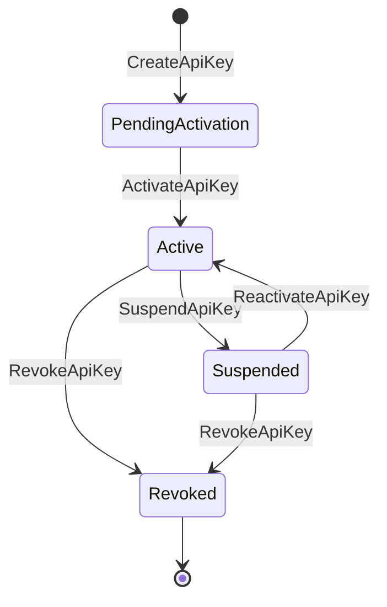

# Step 4 — Per-BC Detailed Design

## Table of Contents

- [Purpose](#purpose)
- [Execution Order](#execution-order)
- [Aggregate Behavior Spec Format (MANDATORY)](#aggregate-behavior-spec-format-mandatory)
- [Per-BC Content Structure](#per-bc-content-structure)
- [Worked Example](#worked-example)
- [Integration Context Summary](#integration-context-summary)
- [Completion Checklist](#completion-checklist)

## Purpose

Define each BC's Aggregate behaviors so developers can **implement directly**. The output of this step mechanically drives Step 5 (BDD scenarios).

## Execution Order

Process BCs by importance — Core first:

1. **Core** domains (e.g., Key Lifecycle)
2. **Supporting** domains tightly coupled to Core (e.g., Access Policy)
3. **Supporting** domains loosely coupled (e.g., Monitoring & Detection)
4. **Supporting** domains for compliance (e.g., Audit & Compliance)
5. **Generic** domains (e.g., Tenant Management)

## Aggregate Behavior Spec Format (MANDATORY)

Every Aggregate behavior MUST use this exact 4-line structure. Always wrap in a fenced code block:

```
Command:  [命令名稱]
Guard:    [前置條件 / 不變條件，用 AND/OR 連接]
State:    [狀態變更：從 → 到]
Event:    [Domain Event 名稱 + 關鍵欄位]
```

### Why This Format Matters

Each field maps directly to Step 5 BDD derivation:

| Spec Field | BDD Mapping |
|------------|-------------|
| `Guard` | `Given` — positive path (guard passes) + negative path (guard fails) |
| `Command` | `When` — the action |
| `State` + `Event` | `Then` — expected outcome |

## Per-BC Content Structure

```
BC: [名稱]
├── Aggregate Root
│   ├── 行為規格（Command → Guard → State → Event）
│   ├── 不變條件彙整
│   └── 狀態轉換圖（Mermaid stateDiagram，如有多狀態）
├── Domain Service（跨 Aggregate 的邏輯）
├── Repository 介面（持久化契約）
└── 適用的設計模式與選擇理由
```

### State Transition Diagrams

Always generate a Mermaid `stateDiagram-v2` if the Aggregate changes state:



## Worked Example

```
BC: Key Lifecycle

Aggregate Root: ApiKey

---

Command:  CreateApiKey
Guard:    租戶金鑰數 < 上限 AND 名稱在租戶內不重複
State:    → PendingActivation
Event:    ApiKeyCreated { keyId, tenantId, name, scope, createdAt }

Command:  ActivateApiKey
Guard:    狀態 == PendingActivation AND 啟用碼有效
State:    PendingActivation → Active
Event:    ApiKeyActivated { keyId, activatedAt }

Command:  RevokeApiKey
Guard:    狀態 ∈ { Active, Suspended } AND 操作者有權限
State:    Active/Suspended → Revoked
Event:    ApiKeyRevoked { keyId, revokedBy, reason, revokedAt }

---

不變條件彙整:
- 同一租戶內金鑰名稱不得重複
- 金鑰總數不得超過租戶上限
- Revoked 狀態為終態，不可逆轉

---

Domain Service: KeyRotationService
- 職責：協調舊金鑰撤銷與新金鑰建立的原子操作
- 規則：新金鑰啟用後才撤銷舊金鑰（零停機）

Repository 介面:
- findByTenantId(tenantId): ApiKey[]
- findByKeyHash(hash): ApiKey?
- save(apiKey): void

設計模式：State Pattern（管理金鑰生命週期狀態轉換）
```

## Integration Context Summary

After completing each BC's Step 4, generate a structured summary (≤50 words) using this template:

```
[BC 名稱]: 核心 Aggregate 為 [X]，關鍵不變式為 [Y]，
已確認與 [BC-B] 透過 [同步/非同步] 整合。
```

**Example:**

```
Key Lifecycle: 核心 Aggregate 為 ApiKey，關鍵不變式為「租戶內名稱唯一且數量受限」，
已確認與 Access Policy 透過非同步 Event（ApiKeyStatusChanged）整合。
```

Carry this summary forward as fixed context when working on subsequent BCs.

## Completion Checklist

- [ ] 所有 Aggregate 行為都用 Command → Guard → State → Event 格式描述
- [ ] 不變條件完整且無矛盾
- [ ] 與 Step 3 的契約一致（Event 名稱、Payload 欄位吻合）
- [ ] 多狀態 Aggregate 附有狀態轉換圖
- [ ] 已產出 Integration Context Summary
